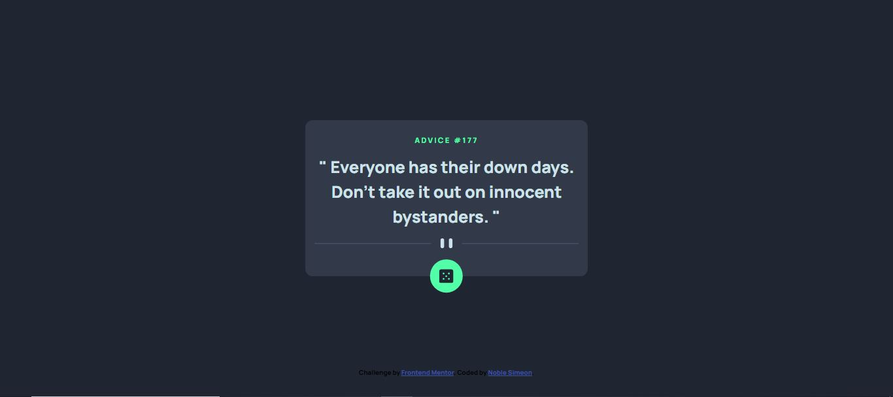

# Frontend Mentor - Advice generator app solution

This is a solution to the [Advice generator app challenge on Frontend Mentor](https://www.frontendmentor.io/challenges/advice-generator-app-QdUG-13db). Frontend Mentor challenges help you improve your coding skills by building realistic projects.

## Table of contents

- [Overview](#overview)
  - [The challenge](#the-challenge)
  - [Screenshot](#screenshot)
  - [Links](#links)
- [My process](#my-process)
  - [Built with](#built-with)
  - [What I learned](#what-i-learned)
  - [Continued development](#continued-development)
  - [Useful resources](#useful-resources)
- [Author](#author)

## Overview

### The challenge

Users should be able to:

- View the optimal layout for the app depending on their device's screen size
- See hover states for all interactive elements on the page
- Generate a new piece of advice by clicking the dice icon

### Screenshot




### Links

- Solution URL: [Link to github repo](https://github.com/NobleSimeon/advice-generator)
- Live Site URL: [Add live site URL here](https://your-live-site-url.com)

## My process

### Built with

- Semantic HTML5 markup
- Flexbox
- CSS Grid
- Mobile-first workflow


### What I learned

Use this section to recap over some of your major learnings while working through this project. 

To see how you can add code snippets, see below:

```html

```
```css

```
```js
function scrambledText(data) {
    setWordBreak("break-all");
    let iterations = 0;

    const interval = setInterval(() => {
        advice.textContent = data.split("")
            .map((letter, index) => {
                if (index < iterations) {
                    return advice.dataset.value[index];
                }
                return letters[Math.floor(Math.random() * 26)];
            })
            .join("");

        if (iterations >= data.length) {
            clearInterval(interval);
            setWordBreak("normal"); // Restore the original word-break setting
        }

        iterations += 3;
    }, 50);
}
```


### Useful resources

- [Hyperplexed](https://www.youtube.com/watch?v=W5oawMJaXbU&list=PLD9xos4mnoHSIDnJjGmhRrxRmHGS8nF91&index=14) - This helped me in creating the scrambledtext

**Note: Delete this note and replace the list above with resources that helped you during the challenge. These could come in handy for anyone viewing your solution or for yourself when you look back on this project in the future.**

## Author

- Website - [Ojelabi Simeon](https://github.com/NobleSimeon)
- Frontend Mentor - [@NobleSimeon](https://www.frontendmentor.io/profile/NobleSimeon)
- Twitter - [@SimeonPelumi](https://www.twitter.com/SimeonPelumi)

